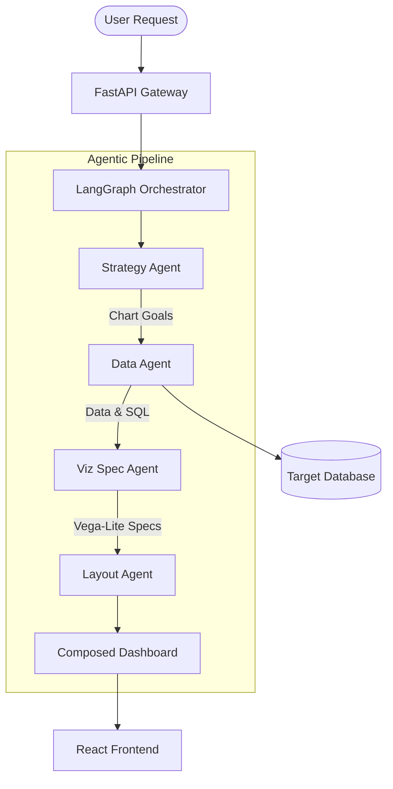
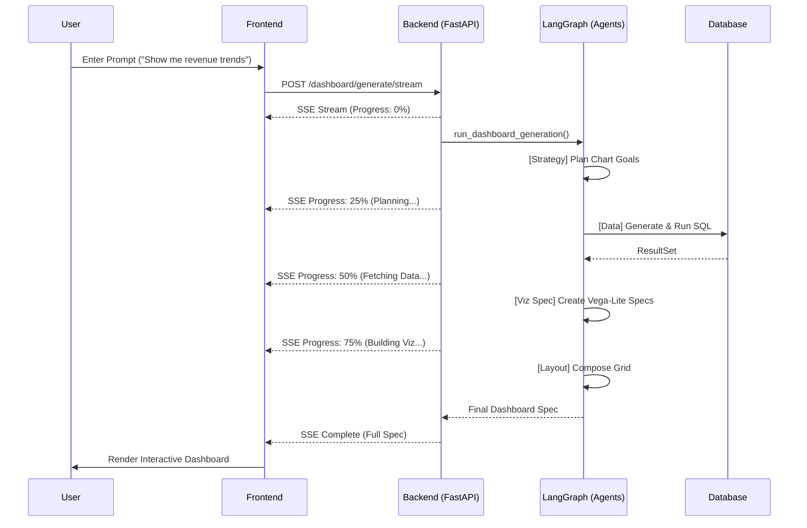

# AI Dashboard

A powerful, agentic AI-powered dashboard generator that converts natural language requests into fully functional, interactive data dashboards using a multi-agent orchestration pipeline.

> [!TIP]
> **New to the project?** Check out our comprehensive [Project Documentation](docs/index.md) for detailed architecture, API docs, and customization guides.

## Architecture Overview

The system employs a 4-stage sequential agent pipeline orchestrated via **LangGraph**. This ensures high-quality reasoning, systematic data fetching, and aesthetically consistent layout composition.



### Core Execution Flow
1.  **Strategy Agent**: Analyzes the user prompt and schema to plan specific chart objectives (chart type, variables, goal).
2.  **Data Agent**: Generates sanitized SQL queries, executes them against the database, and retrieves results.
3.  **Viz Spec Agent**: Translates data and goals into precise **Vega-Lite** JSON specifications.
4.  **Layout Agent**: Determines the optimal responsive grid arrangement for the generated charts.

## Key Features

- **Natural Language to Dashboard**: High-level queries are translated into visual insights without manual SQL or chart configuration.
- **Smart Refinement**: "Chat with your data" to modify chart types, add/remove components, or update titles.
- **Fast Filtering & Drill-Down**: Intelligent sub-query injection for instant (~1s) dashboard-wide filtering.
- **SSE Streaming**: Real-time progress updates via Server-Sent Events during the complex generation process.
- **Multi-DB Support**: Secure connection management for PostgreSQL, MySQL, and more.

## Tech Stack

| Layer      | Core Technologies                                      |
| :--------- | :----------------------------------------------------- |
| Backend    | FastAPI, LangGraph, LangChain, LiteLLM, SQLAlchemy, UV |
| Frontend   | React 19, Vite, Tailwind CSS, Vega-Lite, Shadcn UI     |
| Data       | MongoDB (Logs/Sessions), Target SQL DBs                |
| Python     | 3.13+                                                  |

## Project Structure

```txt
ai-dashboard/
├── backend/
│   ├── app.py                  # Entry point & FastAPI setup
│   ├── langchain_agents/      # LangGraph orchestrator & agents
│   │   ├── dashboard/         # Dashboard-specific agent logic
│   │   │   ├── agents/        # Individual stage implementations
│   │   │   └── graph.py       # Pipeline definition (Strategy -> Data -> Viz -> Layout)
│   ├── routes/                # API endpoints (Auth, Dashboard, Database)
│   ├── services/              # Business logic (DB connection, Sessions)
│   └── utilities/             # Shared helpers (Logger, SSE utils)
├── frontend/
│   ├── src/
│   │   ├── components/        # Dashboard renderer, Chart components
│   │   ├── hooks/             # SSE & API interaction hooks
│   │   └── pages/             # Layout & Auth views
├── Makefile                    # Developer experience commands
└── docker-compose.yml          # MongoDB service for local sessions
```

## Logic Flows

### Dashboard Generation Pathway



## Installation & Setup

### Prerequisites
- Python 3.13+ (managed by `uv`)
- Node.js 18+ & `pnpm`
- Docker (for session storage)

### Quick Start
1.  **Clone & Configure**:
    ```bash
    git clone <repo-url>
    cp backend/.env.example backend/.env
    ```
2.  **Automated Setup**:
    ```bash
    make setup  # Installs backend (uv) and frontend (pnpm)
    ```
3.  **Start Services**:
    ```bash
    make up    # Start MongoDB
    make start # Start Backend (8000) and Frontend (5173)
    ```

## Documentation Wiki

Explore our complete implementation-aware MkDocs wiki inside the `docs/` folder:

- **Foundation**: [Overview & Architecture](docs/architecture/overview.md) | [Data Flows](docs/architecture/data-flow.md) | [Glossary](docs/glossary.md)
- **Backend Internals**: [Core Internals](docs/backend/README.md) | [Routing](docs/backend/routing.md) | [LangGraph & Services](docs/backend/services.md)
- **Frontend Architecture**: [Overview](docs/frontend/README.md) | [State & Streams](docs/frontend/state-management.md) | [Components](docs/frontend/components.md)
- **API Reference**: [Endpoints](docs/api-reference/backend-endpoints.md) | [Examples](docs/api-reference/request-response-examples.md)
- **Developer Guides**: [Local Setup](docs/development/local-setup.md) | [Docker Infrastructure](docs/development/docker.md) | [Debugging](docs/development/debugging.md)
