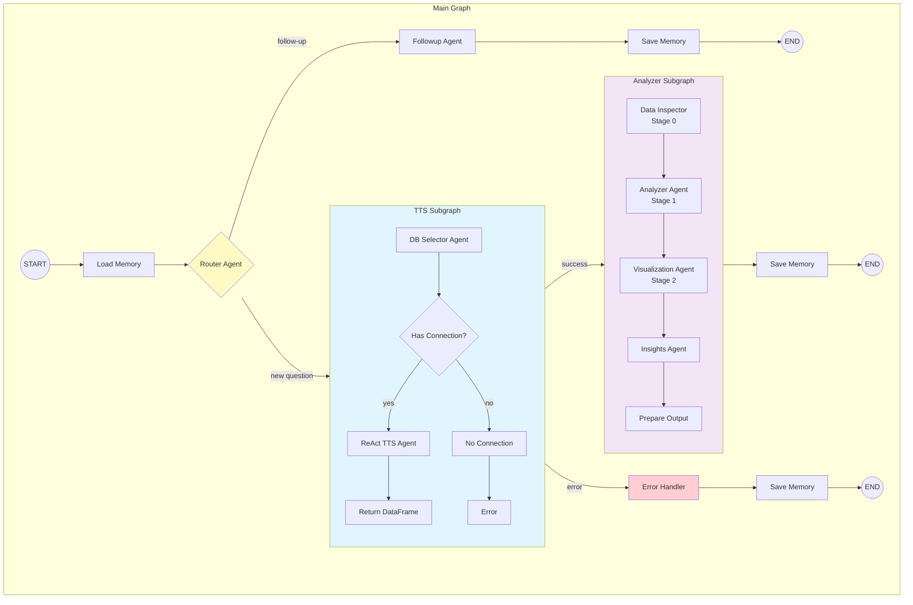
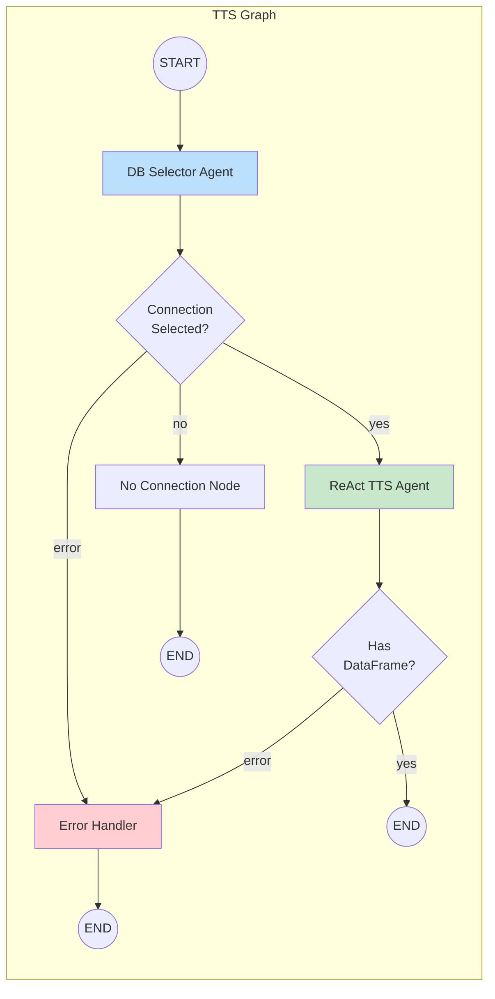
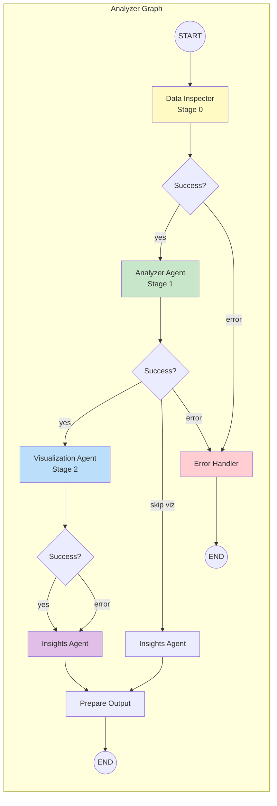
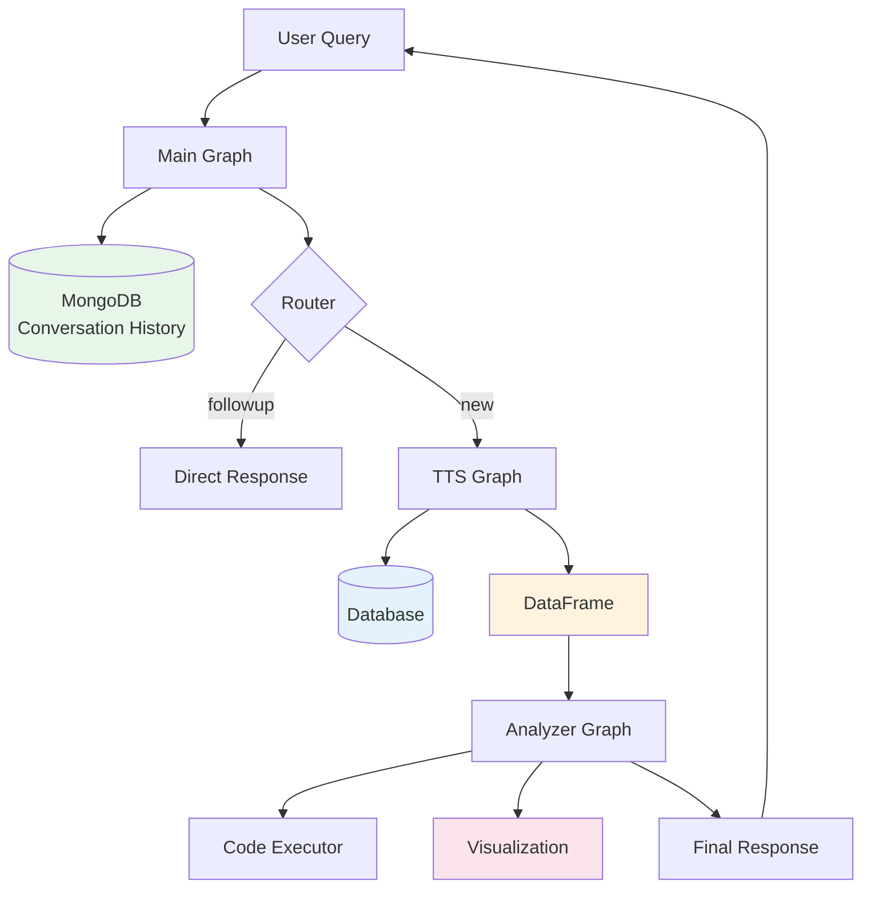

# LangChain/LangGraph Unified Agent System

This module implements a LangGraph-based unified agent system that replaces the vanilla Python implementation while preserving the exact same functionality.

## Overview

The system uses LangGraph's StateGraph architecture with subgraphs for modularity and streaming support. It follows the flow described in `langchain_overview_temp.md`.

## Architecture

### Main Graph Flow



### TTS Subgraph Detail



### Analyzer Subgraph Detail



### Data Flow Overview



### ASCII Architecture (for non-Mermaid viewers)

```text
┌─────────────────────────────────────────────────────────────────────────┐
│                           MAIN GRAPH                                     │
│  ┌──────────┐    ┌────────┐    ┌──────────────────────────────────────┐ │
│  │  Memory  │───▶│ Router │───▶│  Follow-up Path                     │ │
│  │  (load)  │    │        │    │  ┌──────────┐                        │ │
│  └──────────┘    └────────┘    │  │ Followup │──────────────────────┐ │ │
│                       │        │  │  Agent   │                      │ │ │
│                       │        │  └──────────┘                      │ │ │
│                       ▼        └──────────────────────────────────────┘ │
│              ┌─────────────────────────────────────────────────────┐    │
│              │              TTS SUBGRAPH                           │    │
│              │  ┌─────────────┐    ┌──────────────┐                │    │
│              │  │ DB Selector │───▶│  ReAct TTS   │                │    │
│              │  │    Agent    │    │    Agent     │                │    │
│              │  └─────────────┘    └──────────────┘                │    │
│              └─────────────────────────────────────────────────────┘    │
│                                    │                                     │
│                                    ▼                                     │
│              ┌─────────────────────────────────────────────────────┐    │
│              │            ANALYZER SUBGRAPH                        │    │
│              │  ┌───────────┐  ┌──────────┐  ┌─────┐  ┌──────────┐ │    │
│              │  │   Data    │─▶│ Analyzer │─▶│ Viz │─▶│ Insights │ │    │
│              │  │ Inspector │  │  Agent   │  │Agent│  │  Agent   │ │    │
│              │  │ (Stage 0) │  │(Stage 1) │  │(S2) │  │          │ │    │
│              │  └───────────┘  └──────────┘  └─────┘  └──────────┘ │    │
│              └─────────────────────────────────────────────────────┘    │
│                                    │                                     │
│                                    ▼                                     │
│                            ┌──────────────┐                              │
│                            │    Memory    │                              │
│                            │    (save)    │                              │
│                            └──────────────┘                              │
└─────────────────────────────────────────────────────────────────────────┘
```

## Module Structure

```
langchain_agents/
├── __init__.py                 # Main exports
├── README.md                   # This documentation
├── state.py                    # State definitions (TypedDicts)
├── llm_utils.py               # LiteLLM wrapper for LangChain
├── agents/
│   ├── __init__.py
│   ├── memory_agent.py        # Conversation history management
│   ├── router_agent.py        # Routes follow-up vs new questions
│   ├── followup_agent.py      # Handles follow-up questions
│   ├── db_selector_agent.py   # Database selection logic
│   ├── react_tts_agent.py     # ReAct Text-to-SQL agent
│   ├── data_inspector_agent.py # Stage 0 - DataFrame inspection
│   ├── analyzer_agent.py      # Stage 1 - Data aggregation/analysis
│   ├── visualization_agent.py # Stage 2 - Chart generation
│   └── insights_agent.py      # Final insights generation
├── graphs/
│   ├── __init__.py
│   ├── tts_graph.py           # TTS subgraph
│   ├── analyzer_graph.py      # Analyzer subgraph
│   └── main_graph.py          # Main orchestration graph
└── tools/
    ├── __init__.py
    ├── code_execution.py      # Safe Python code execution
    └── database_tools.py      # Database schema/query tools
```

## State Definitions

### MainGraphState

The top-level state for the main graph, containing:

- User input (`user_query`, `username`, `session_id`)
- Conversation history (with append reducer)
- Router decision (`route_decision`, `route_reasoning`)
- TTS outputs (`selected_connection`, `dataframe`, `sql_query`)
- Analyzer outputs (`analysis_data`, `visualization_image`, `insights`)
- Final response (`final_response`, `final_image`, `final_data`)
- Error handling (`error`)

### TTSGraphState

State for the Text-to-SQL subgraph:

- Input (`user_query`, `username`)
- DB selection (`selected_connection`, `db_selection_reasoning`)
- TTS outputs (`dataframe`, `sql_query`, `tts_iterations`, `tts_execution_history`)

### AnalyzerGraphState

State for the Analyzer subgraph:

- Input from TTS (`dataframe`, `sql_query`, `tts_execution_history`)
- Stage 0 outputs (`df_summary`, `inspection_code`, `inspection_output`)
- Stage 1 outputs (`analysis_data`, `analysis_code`, `analysis_comments`)
- Stage 2 outputs (`visualization_image`, `visualization_code`)
- Final (`insights`)
- Execution history (`analyzer_execution_history`) - tracks code and outputs from each stage

## Agents

### MemoryAgent

- Loads conversation history from MongoDB at the start
- Saves updated history at the end of processing
- Maintains session-based memory management

### RouterAgent

- Analyzes if the user query is a follow-up question
- Uses conversation history context
- Routes to either `followup` or `new_question` path

### FollowupAgent

- Handles follow-up questions using conversation context
- Has access to code execution for data analysis
- Generates direct responses without going through TTS

### DBSelectorAgent

- Retrieves available database connections for the user
- Analyzes which database is relevant for the query
- Returns selected connection name and reasoning

### ReActTTSAgent

- Implements ReAct (Reasoning + Acting) pattern
- Uses tools: `get_db_schema`, `get_table_info`, `get_table_sample`, `get_column_values`, `run_sql_query`
- Iteratively builds and refines SQL queries
- Returns final dataframe and SQL query

### DataInspectorAgent (Stage 0)

- Inspects the dataframe structure
- Generates summary statistics
- Provides context for downstream analysis

### AnalyzerAgent (Stage 1)

- Performs data aggregation and analysis
- Generates Python code to create `data` variable
- Executes code safely using LocalPythonExecutor

### VisualizationAgent (Stage 2)

- Creates visualizations using matplotlib/plotly
- Generates base64-encoded images
- Uses templates from utilities for consistent styling

### InsightsAgent

- Generates final natural language insights
- Summarizes analysis results
- Creates the response for the user

## Graphs

### TTS Graph (`tts_graph.py`)

```
START → db_selector → [conditional] → react_tts → END
                    ↘ no_connection → END
                    ↘ error_handler → END
```

### Analyzer Graph (`analyzer_graph.py`)

```
START → data_inspector_node → analyzer_node → visualization_node → insights_node → prepare_output → END
                            ↘ error_handler → END
```

### Main Graph (`main_graph.py`)

```
START → load_memory → router → [conditional] → followup → save_memory → END
                             ↘ tts_subgraph → [conditional] → analyzer_subgraph → prepare_output → save_memory → END
                                            ↘ error_handler → save_memory → END
```

## Usage

### Basic Query

```python
from langchain_agents import run_query

result = await run_query(
    user_query="Show me total sales by region",
    username="user123",
    session_id="session-abc"
)

print(result["final_response"])
print(result["final_data"])  # JSON-serializable data
print(result["final_image"])  # Base64-encoded image
```

### Streaming Query

```python
from langchain_agents import run_query_streaming

async for update in run_query_streaming(
    user_query="What were the top products last month?",
    username="user123",
    session_id="session-abc"
):
    namespace = update.get("namespace", ())
    updates = update.get("updates", {})

    # Handle intermediate updates
    for node_name, node_output in updates.items():
        print(f"[{'/'.join(namespace) or 'main'}:{node_name}] {list(node_output.keys())}")
```

### Using Subgraphs Directly

```python
from langchain_agents import run_tts_graph, run_analyzer_graph

# Run TTS only
tts_result = await run_tts_graph(
    user_query="Get all customers from New York",
    username="user123"
)

# Run analyzer with existing dataframe
analyzer_result = await run_analyzer_graph(
    user_query="Summarize this data",
    username="user123",
    dataframe=tts_result["dataframe"],
    sql_query=tts_result["sql_query"]
)
```

## Key Features

### 1. Subgraph Architecture

- TTS and Analyzer are separate compilable subgraphs
- Can be tested and used independently
- Clear separation of concerns

### 2. Streaming Support

- Built-in streaming with `stream_mode="updates"`
- Subgraph updates are propagated with namespace
- Real-time progress visibility

### 3. LiteLLM Integration

- Wraps existing LiteLLM service for LangChain compatibility
- Uses `LiteLLMWrapper` extending `BaseChatModel`
- Supports both sync and async operations

### 4. Memory Persistence

- MongoDB-based conversation history
- Session-scoped memory management
- Automatic load/save around graph execution

### 5. Safe Code Execution

- Uses `LocalPythonExecutor` for sandboxed execution
- Pre-authorized imports and functions
- Execution timeout support

### 6. Error Handling

- Dedicated error handler nodes in each graph
- Graceful degradation (e.g., continue to insights on viz failure)
- Error propagation through state

## Migration from Vanilla Python

This module replaces the following vanilla Python components:

| Original                               | LangGraph Equivalent                                                   |
| -------------------------------------- | ---------------------------------------------------------------------- |
| `services/agents/base.py`              | `langchain_agents/llm_utils.py`                                        |
| `services/agents/react_tts_agent.py`   | `langchain_agents/agents/react_tts_agent.py`                           |
| `services/agents/db_selector.py`       | `langchain_agents/agents/db_selector_agent.py`                         |
| `services/agents/data_scientist.py`    | `langchain_agents/agents/analyzer_agent.py` + `visualization_agent.py` |
| `services/agents/data_selector.py`     | Integrated into analyzer stages                                        |
| `services/local_python_interpreter.py` | Wrapped in `langchain_agents/tools/code_execution.py`                  |

## Dependencies

Added to `requirements_prod.txt`:

```
langchain>=0.3.0
langchain-core>=0.3.0
langgraph>=0.2.0
```

## Configuration

The module uses existing configuration from `env.py`:

- `LLM_MODEL`: Model identifier for LiteLLM
- `USE_SAFE_EXECUTOR`: Toggle for safe code execution
- `MONGO_URI`: MongoDB connection for memory storage
- `MONGO_DB_NAME`: Database name for memory

## Notes

### Node Naming Convention

LangGraph requires node names to not conflict with state keys. We use suffixed names:

- `insights_node` instead of `insights`
- `error_handler` instead of `error`
- `analyzer_node` instead of `analyzer`

### State Reducers

- `conversation_history` uses `append_messages` reducer for accumulation
- `metadata` uses `merge_dicts` reducer for updates
- Other fields use default overwrite behavior

### Checkpointing

The main graph supports optional checkpointing via `InMemorySaver` or custom checkpointers for persistence across sessions.
