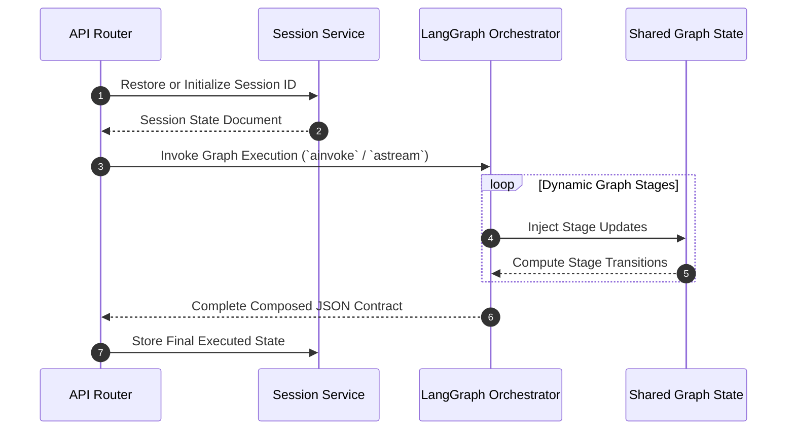
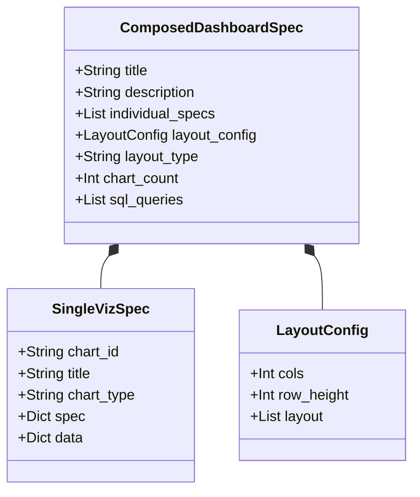

# Backend Architecture

The backend of the **AI Dashboard** relies on **FastAPI** coupled with a **LangGraph** orchestration runtime. The structure is built around strict data validation, localized agent execution, and non-blocking asynchronous event streams.

---

## 1. Request Lifecycle Engine

When a client initiates a request, it traverses distinct structural bounds:



---

## 2. Stateful Orchestration via LangGraph

Traditional straight-line prompting pipelines struggle with partial failures, context overflow, and structural schema output constraints. We resolve this by implementing a **StateGraph** pattern.

### The Graph State Model
All nodes read from and write to a centralized state class (`DashboardGraphState`), which acts as an immutable transition log:

```python
class DashboardGraphState(TypedDict):
    user_prompt: str
    username: str
    connection_name: str
    session_id: str
    max_charts: int
    theme: str
    
    # Cumulative pipeline tracking
    chart_goals: List[dict]
    chart_data_results: List[dict]
    viz_specs: List[dict]
    dashboard_spec: Optional[dict]
    
    # Exception/Execution metadata
    error: Optional[str]
    failed_stage: Optional[str]
```

### Conditional Stage Transitions
Between every stage, explicit structural validation handlers evaluate outputs before advancing to the subsequent agent node:
- **Strategy Post-check**: Guarantees generation of at least 1 viable chart goal.
- **Data Post-check**: Scans output arrays to ensure successful query execution against active database pools.
- **Viz Post-check**: Asserts that every produced configuration block passes basic JSON structure verification.

---

## 3. Strict Serialization Contracts

To protect downstream frontend consumption from incomplete generation payloads, the system maps internal structures using nested **Pydantic** validation models:


