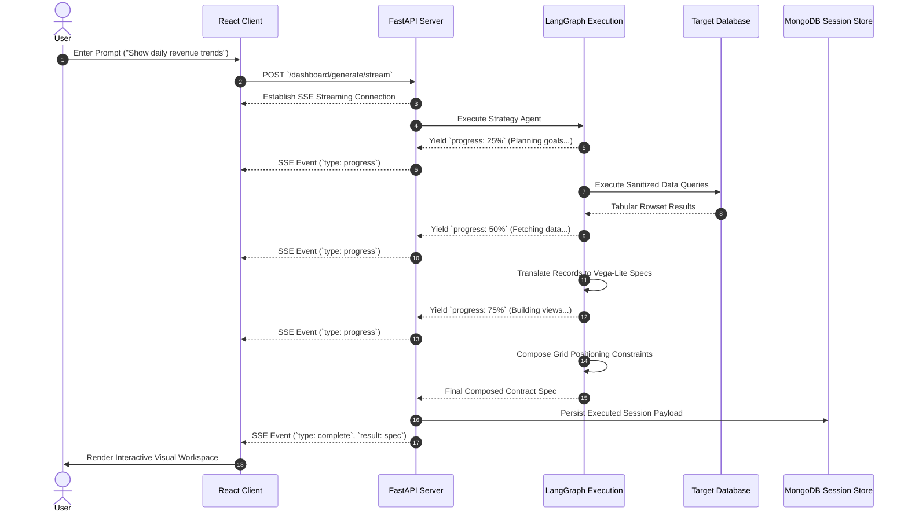
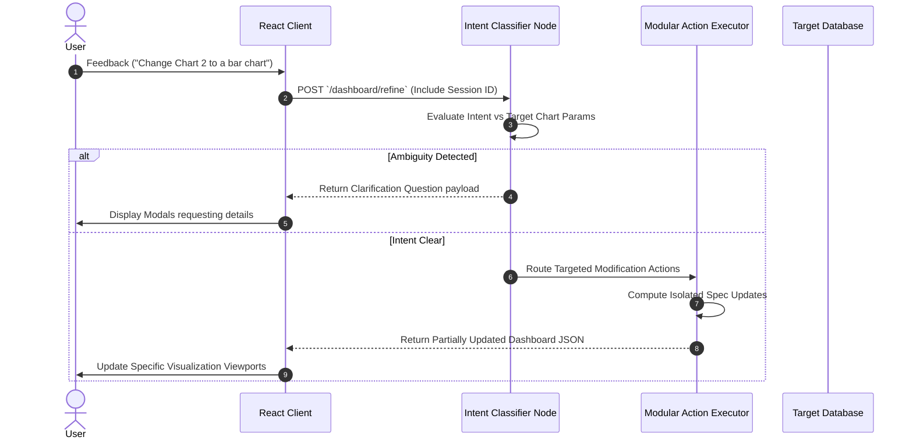
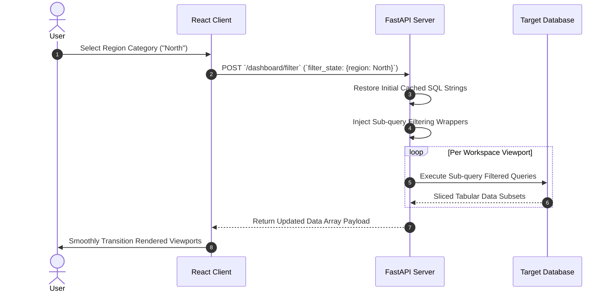

# System Data Flows

The **AI Dashboard** orchestration pathways rely on structured request pipelines. Below are detailed execution tracings for primary generation and operational tasks.

---

## 1. Generation Stream Pipeline (`POST /dashboard/generate/stream`)

This flow handles fresh dashboard construction from user inputs, emitting incremental status updates back to the UI.

---

## 2. Intent Refinement Lifecycle (`POST /dashboard/refine`)

When a user initiates modifications on an existing dashboard context, the system utilizes intent classification to bypass complete pipeline re-runs.

---

## 3. Real-time Sub-query Filtering (`POST /dashboard/filter`)

Enables drill-down selections to instantly slice active metrics across the workspace without invoking the LLM generation stack.

