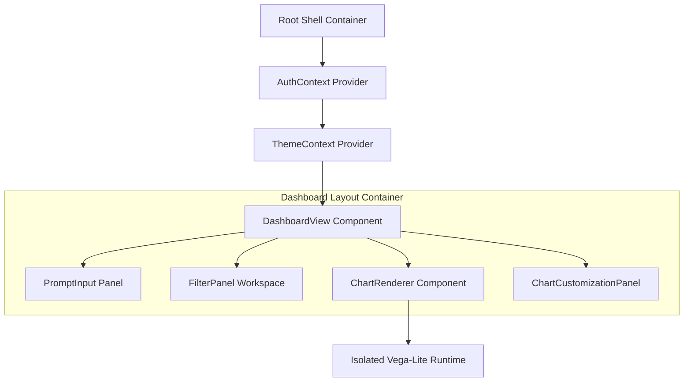

# Frontend Architecture

The **AI Dashboard** frontend application provides the presentation and interactivity layer. Built on **React 19**, **Vite**, and **Tailwind CSS**, it dynamically parses composed **Vega-Lite** configuration JSONs into interactive charts.

---

## 1. Visual Component Hierarchy



---

## 2. Dynamic Component Design

### A. Strict Contract Safety
The client enforces type bindings mirroring backend Pydantic models using **TypeScript**. This guarantees compile-time verification when unpacking generated specifications:

```typescript
export interface ChartLayoutPosition {
  i: string;
  x: number;
  y: number;
  w: number;
  h: number;
}

export interface ComposedDashboardSpec {
  title: string;
  description?: string;
  vega_lite_spec: Record<string, any>;
  individual_specs: Array<{
    chart_id: string;
    title: string;
    chart_type: string;
    spec: Record<string, any>;
    data?: Record<string, any>;
  }>;
  layout_config?: {
    cols: number;
    row_height: number;
    layout: ChartLayoutPosition[];
  };
}
```

### B. Isolated Vega-Lite Engine Integration
Rendering complex raw data objects directly into web graphics structures can cause performance bottlenecks or page instability if JSON configuration parameters contain syntax bugs.

To resolve this, chart components wrap standard `vega-embed` runtime logic inside decoupled functional modules combined with **React Error Boundaries**:
- **Automatic Container Sizing**: Charts utilize CSS bounding constraints (`width: 'container'`, `height: 'container'`) to automatically resize alongside fluid responsive dashboard grid columns.
- **Fail-safe Catching**: If an individual chart block encounters rendering parse errors, localized fallback wrappers isolate the fault, preventing global workspace crashes.

---

## 3. Client State Lifecycles

State is managed locally within highly focused component regions using custom hooks:
- **`useStreamingGeneration`**: Hooks directly into Server-Sent Events streams, managing live telemetry transitions (`progress: 25% -> 50% -> 100%`) to display informative inline progress notifications.
- **`useChartCustomization`**: Exposes fine-grained local state mutations allowing users to update titles, swap palette attributes, or adjust layout bounds dynamically without network re-fetches.
