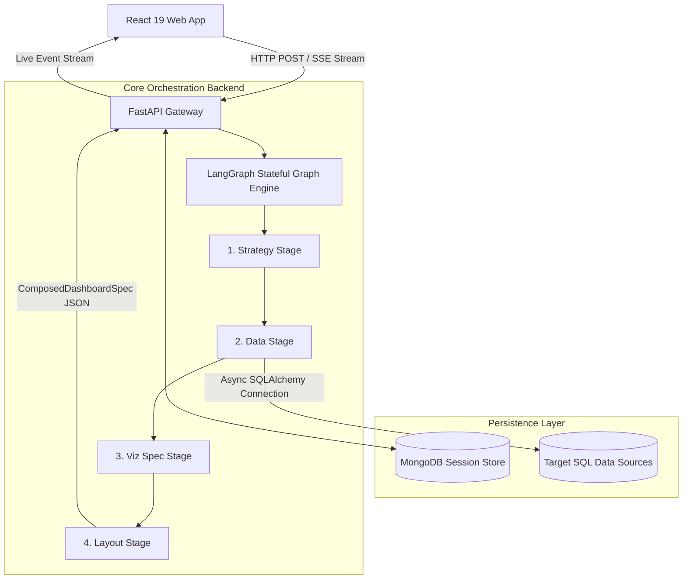

# Architecture Blueprint

The **AI Dashboard** platform implements a decoupled, event-driven architecture designed to transform natural language data queries into fully responsive interactive dashboards.

---

## High-Level System Architecture

---

## Subsystem Responsibilities

### 1. Presentation Layer (React 19 + Vite)
- Serves as the consumer of composed **Vega-Lite** configuration schemas.
- Maintains responsive viewports, isolated client-side filter contexts, and user input validation via **Shadcn UI** components.
- Handles custom loading skeletons responding to multi-stage real-time Server-Sent Events emitted during complex generation.

### 2. API Gateway Layer (FastAPI)
- Governs connection lifecycle, JSON Payload serialization, request validation via strict **Pydantic** models, and Bearer token authentication.
- Bypasses reverse-proxy buffering (`X-Accel-Buffering: no`) to stream real-time pipeline checkpoints via generator endpoints directly to the browser.

### 3. Orchestration Layer (LangGraph)
- Orchestrates multi-actor generation processes using an explicit state diagram (`DashboardGraphState`).
- Decouples monolithic reasoning into sequential specialized micro-agents, bounding potential failure cascades and enabling localized re-tries.

### 4. Database Access Layer (SQLAlchemy Async)
- Establishes read-only engine pools to execute LLM-formulated query strings contextually against specified data catalogs.
- Applies pre-execution regex safety scrubbing to guarantee queries contain zero schema mutation/deletion commands.

### 5. Session State Layer (MongoDB)
- Persists raw conversational user inputs, schema snapshots, intermediate stage outputs, and historical execution SQL blocks.
- Enables contextual conversation restoration to drive localized natural language refinement (`POST /dashboard/refine`).
