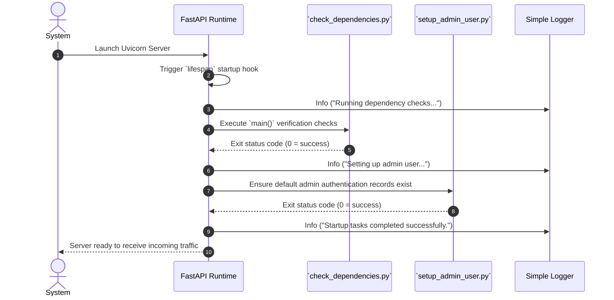

# Application Initialization

The FastAPI backend uses an explicit **Lifespan** context manager inside `backend/app.py` to ensure critical bootstrapping dependencies are satisfied before accepting web traffic.

---

## Startup Sequence



### Pre-Flight Failure Handling
If either dependency evaluation or user provisioning exits with a non-zero exit code, the lifespan hook executes `sys.exit(1)`. This fail-fast approach prevents deploying a compromised service to production.

---

## Global Middleware and Routing Registration

Following standard initialization procedures, global routing contexts are attached to the API instance:

```python
app = FastAPI(title="Dashboard Generation API", version="0.1.0", lifespan=lifespan)

# Attached Global Middleware
app.add_middleware(
    CORSMiddleware,
    allow_origins=["*"],
    allow_credentials=True,
    allow_methods=["*"],
    allow_headers=["*"],
)

# Core Router Inclusions (Order Independent but Logically Segregated)
app.include_router(auth)
app.include_router(database_router)
app.include_router(dashboard_router)
```

### Baseline Health Check Endpoints
The base API instance attaches direct root verifiers to validate load-balancer connections:
- `GET /`: Outputs global application identifier payloads.
- `GET /health`: Yields basic status indicators (`{"status": "healthy"}`).
