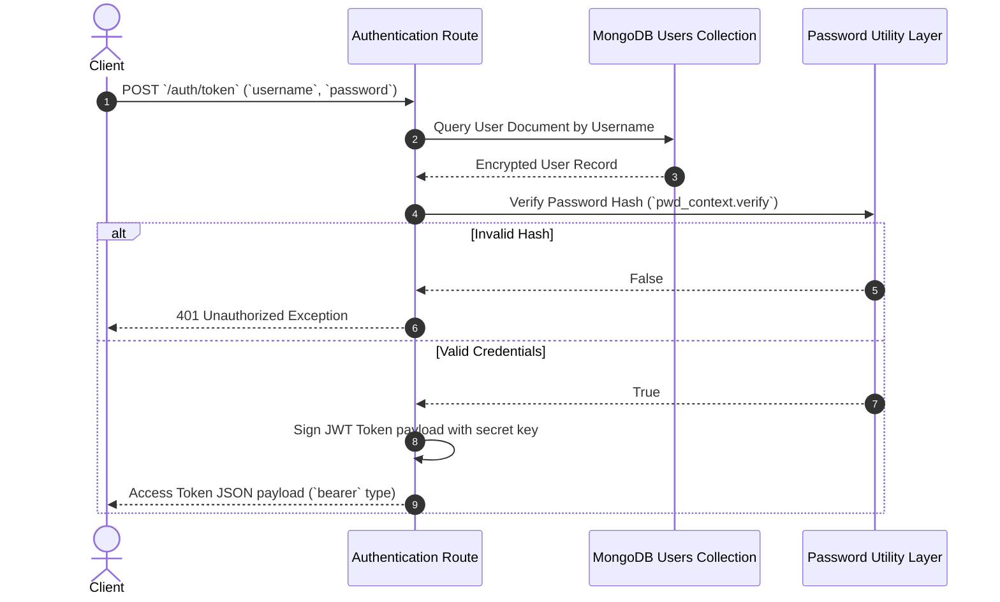

# Authentication Mechanism

The **AI Dashboard** enforces authentication using standard **OAuth2** patterns with **JSON Web Tokens (JWT)**. Token exchange, security headers, and user record verifications are managed centrally inside `routes/auth.py`.

---

## 1. Token Exchange Protocol

Clients authenticate by exchanging credentials for short-lived access tokens via `POST /auth/token`.



---

## 2. JWT Generation & Payload Architecture

Upon successful password verification, the server encodes identity parameters into cryptographically signed string assertions:

```python
def create_access_token(data: dict, expires_delta: Optional[timedelta] = None) -> str:
    """Signs identity claims using symmetric HMAC algorithms."""
    to_encode = data.copy()
    # Appends token lifetime boundaries
    ...
```

### Standard Token Claims
- **`sub`**: The authenticated subject identifier (typically the account username).
- **`exp`**: The token expiration timestamp, enforcing automatic session timeout policies.

---

## 3. Cryptographic Storage Standards

To protect authentication records from unauthorized discovery, user accounts store sensitive parameters as salted, one-way cryptographic hashes.

### The `pwd_context` Utility
The system uses `passlib` configured with modern hashing schemes (`bcrypt`) to process clear-text inputs safely. This ensures password strings are never stored or logged in plain text.
