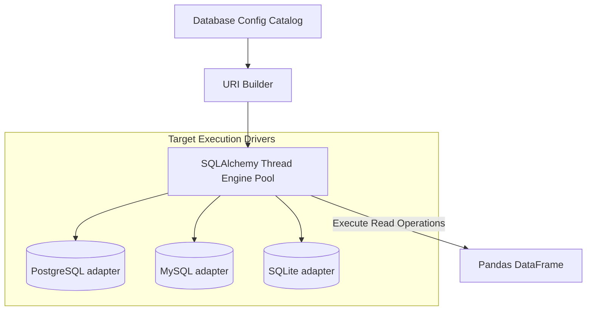

# Database Access Orchestration

The **AI Dashboard** interacts with dynamic user-provided databases to fetch underlying metrics. Security, query parsing, and runtime driver connection pooling are handled by dedicated service layers.

---

## 1. Asynchronous Connection Pooling

The database access layer uses **SQLAlchemy** to interface with diverse storage backends (PostgreSQL, MySQL, SQLite). Connection logic is managed centrally to ensure efficient resource reuse across generation cycles:



---

## 2. Uncompromising SQL Security Verification

Because target SQL query blocks are generated by an LLM, the system implements proactive filtering checks before execution. This prevents accidental data loss or unauthorized modifications.

### Pre-Execution Scrubbing Flow
Before handing queries to the database driver, strings pass through regex filters:
- **Mandatory Read Pattern**: Requires queries to begin with standard read prefixes (`SELECT`, `WITH`).
- **Destructive Command Verification**: Scans query blocks for write/schema operations (`DROP`, `DELETE`, `UPDATE`, `INSERT`, `ALTER`, `TRUNCATE`, `GRANT`). If detected, execution halts immediately and returns a specific security warning payload.

---

## 3. Query Execution & DataFrame Translation

To maximize efficiency, the execution layer avoids instantiating large collections of intermediate ORM objects. Instead, query result buffers map directly to memory formats:

```python
def run_query_and_return_df(connection_string: str, query: str) -> Optional[pd.DataFrame]:
    """Executes validated string operations, outputting parsed DataFrame tables."""
    # Internal driver interaction bypasses standard object mappings
    # to load read records natively.
    ...
```

### Automatic Data Formatting
Once loaded into DataFrames, numeric metrics, timestamp strings, and missing attributes are converted to standard JSON-compatible types before serializing to downstream client endpoints.
