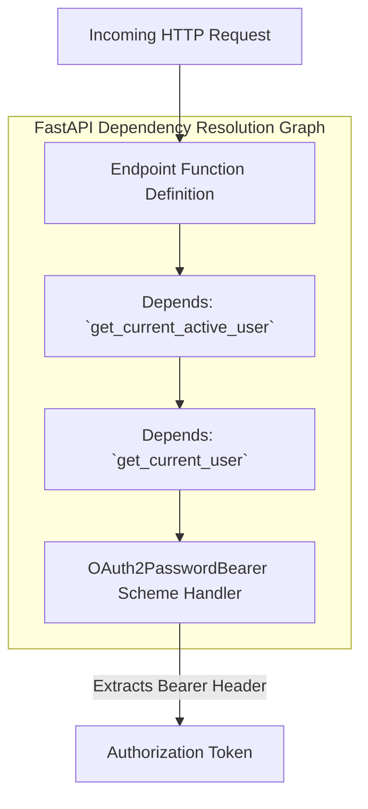

# Dependency Injection

The backend uses **FastAPI**'s native dependency injection engine (`Depends`) to decouple authentication enforcement, user status validations, and session hydration from core application logic.

---

## 1. Security Dependency Hierarchy

Endpoints enforce authentication by chaining modular validation dependencies:



### Resolution Flow
1. **`OAuth2PasswordBearer`**: Extracts raw tokens from request authorization headers.
2. **`get_current_user`**: Decodes JWT payloads, verifies internal signing keys, and restores associated MongoDB user accounts.
3. **`get_current_active_user`**: Inspects user claims to confirm active account status, rejecting disabled users.

---

## 2. Injection Patterns in Routes

By injecting dependencies directly into endpoint signatures, route functions remain clean and focused on business execution:

```python
@router.post("/generate", response_model=DashboardResponse)
async def generate_dashboard(
    request: DashboardGenerateRequest,
    current_user: User = Depends(get_current_active_user),
):
    # Route execution receives a fully validated User instance.
    username = current_user.username
    ...
```

### Benefits of Explicit Dependencies
- **Type Safety**: IDEs and linters validate downstream consumer interfaces natively.
- **Testability**: Tests can swap out authentication models by overriding dependency mappings (`app.dependency_overrides`).
