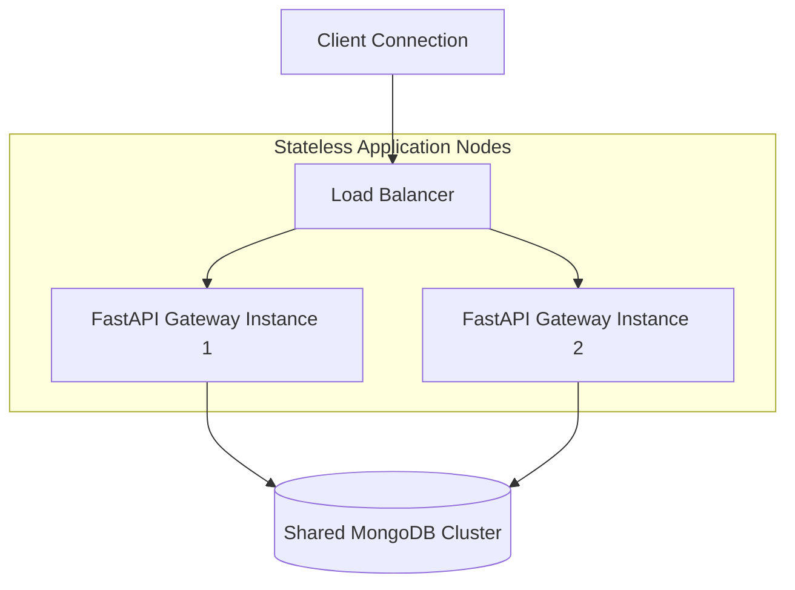

# Infrastructure Recommendations

Deployment guidelines for hosting the **AI Dashboard** application across cloud environments.

---

## 1. Stateless API Node Sizing

The FastAPI gateway handles compute-heavy tasks like schema serialization, Pydantic validations, and real-time SSE streaming generation.

### Sizing Baseline
- **CPU**: Since multi-stage agent workflows run within localized Python async execution loops, assign multi-core instances (minimum 2 vCPUs) to prevent stream bottlenecks.
- **Memory**: Base workers need sufficient memory buffers (minimum 2GB RAM per running container) to process intermediate Pandas DataFrames efficiently.

---

## 2. Horizontal Scaling Guidelines

Because generation streams emit directly over open network connections, routing needs careful infrastructure configuration:

### Routing Considerations
- **Session Restoration**: Because final dashboard configurations are persisted centrally inside MongoDB, subsequent refinement operations (`POST /dashboard/refine`) can route to any healthy stateless gateway instance safely.
- **Connection Throughput**: Ensure downstream load balancers have generous request timeouts configured (e.g., 30+ seconds) to prevent dropping open SSE streaming sockets during complex agent generations.
