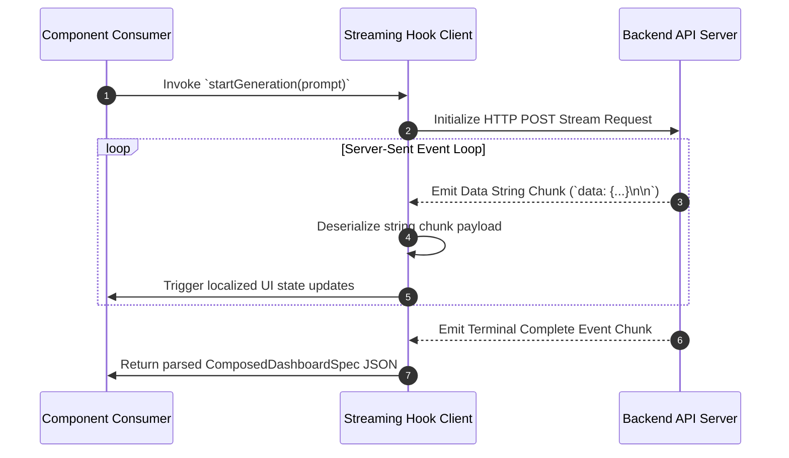

# API Client Layer

Frontend network calls route through a typed API client layer (`src/api/client.ts`). This abstraction manages authentication headers, serialization, and error mapping centrally.

---

## 1. Automated Authorization Header Injection

To simplify component network calls, the HTTP client automatically reads persisted tokens from local storage and appends them to outgoing request headers:

```typescript
// Chained request injection guarantees Bearer tokens are attached safely.
const getHeaders = () => {
  const token = localStorage.getItem('token');
  return {
    'Content-Type': 'application/json',
    ...(token ? { Authorization: `Bearer ${token}` } : {}),
  };
};
```

---

## 2. Unidirectional Streaming Engine (`useStreamingGeneration`)

Standard REST requests wait for complete backend generation cycles before updating the client UI. For long-running dashboard generations, the UI relies on streaming updates using the **Server-Sent Events (SSE)** protocol:



---

## 3. Strict Contract Verification

Client network operations map responses directly to Typescript interface models mirroring backend Pydantic structures. This compile-time safety prevents runtime crashes caused by malformed response payloads.
