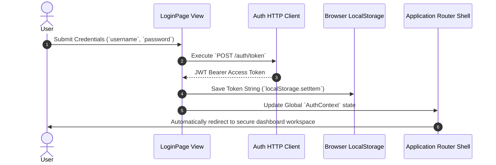

# Client Authentication Flow

Client authentication relies on short-lived JWT tokens managed securely by local contexts.

---

## 1. Authentication Lifecycle



---

## 2. Token Storage Strategy

To simplify hydration across page reloads, authenticated JWT blocks are persisted directly within browser local storage structures:

```typescript
// Persists verified authentication tokens locally to preserve user sessions.
localStorage.setItem('token', access_token);
```

### Protection Measures
- **Explicit Scoping**: Tokens only grant access to backend route endpoints associated with the current user account, preventing unauthorized actions on cross-tenant collections.
- **Auto-Eviction**: If API network requests return `401 Unauthorized` responses due to expired signatures, client interceptors automatically purge stored token strings and redirect to the login screen.

---

## 3. Graceful Logout Pathways

When a user triggers a manual session disconnect, the client executes cleanup tasks to clear authentication context:
1. Purges local token strings from storage buffers (`localStorage.removeItem('token')`).
2. Resets the central `AuthContext` status back to unauthenticated defaults.
3. Redirects viewports back to the root login entry point safely.
