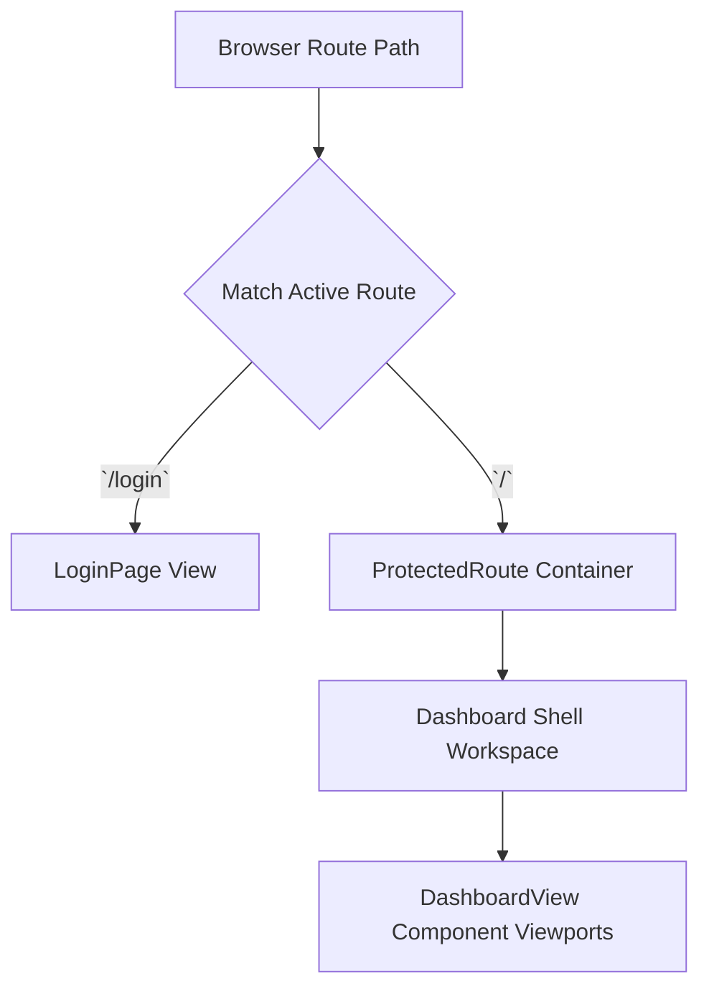

# Routing Architecture

Frontend client views are structured using declarative routing parameters. Access control boundaries wrap protected interface components to enforce authentication.

---

## 1. Protected Route Integration (`ProtectedRoute.tsx`)

To prevent unauthorized access to active metrics or database settings, main workspace routes are wrapped inside protected boundary containers:

```tsx
import React from 'react';
import { Navigate } from 'react-router-dom';
import { useAuth } from '../contexts/AuthContext';

export const ProtectedRoute: React.FC<{ children: React.ReactNode }> = ({ children }) => {
  const { isAuthenticated, isLoading } = useAuth();

  if (isLoading) {
    return <div className="flex h-screen items-center justify-center">Loading session...</div>;
  }

  if (!isAuthenticated) {
    // Automatically redirect unauthenticated clients to login screen
    return <Navigate to="/login" replace />;
  }

  return <>{children}</>;
};
```

---

## 2. Router Layout Configuration

The top-level application shell maps primary interface modules using structural layouts:



### Automatic Navigation Behaviors
- **Session Expiration**: If REST requests return `401 Unauthorized` responses during user operations, the API client hook automatically updates the central auth state. This triggers an immediate redirect back to the login screen.
