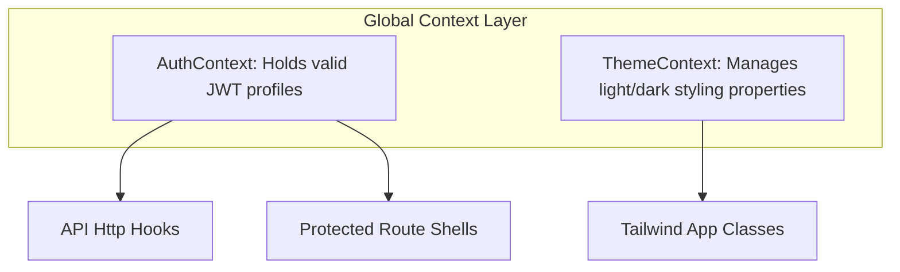

# State Management

The frontend uses localized **React Contexts** combined with custom component-level hooks to manage UI interactions and streaming server data.

---

## 1. Global Context Providers

Shared client attributes are exposed to child components via dedicated context containers:

---

## 2. Dynamic Component State Hooks

Complex business interactions stay isolated inside reusable hooks to simplify presentation logic:

### `useStreamingGeneration`
Handles unidirectional streaming updates during dynamic generation tasks:
- **State Tracing**: Subscribes directly to open HTTP connection strings, mapping raw text payloads to interface updates.
- **UI Fallbacks**: Sets interface layouts to informative skeleton states automatically during intermediate pipeline stages.

### `useChartCustomization`
Exposes scoped manipulation routines allowing users to refine dashboard views locally:
- **Title Updates**: Supports inline adjustments to rendered chart titles.
- **Style Re-assignments**: Toggles color palettes and styling properties dynamically without making network requests.
