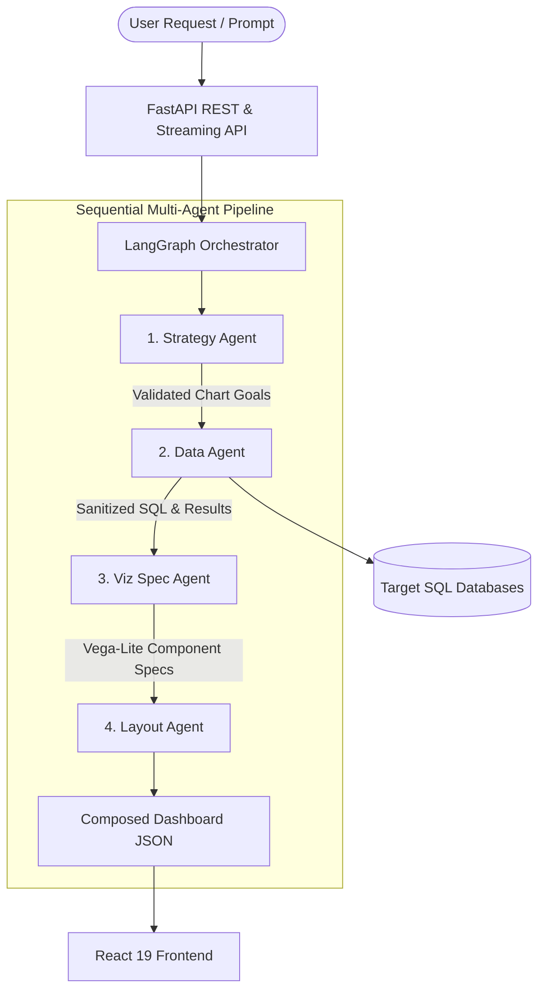

# AI Dashboard Technical Wiki

Welcome to the **AI Dashboard** technical documentation. This wiki is intended for backend and frontend engineers, technical architects, and maintainers responsible for onboarding, extending, debugging, and operating the dashboard generation platform.

---

## Executive Summary

The **AI Dashboard** is an enterprise-grade platform that converts natural language requests into complex, responsive, interactive **Vega-Lite** data visualizations. Rather than relying on simple templates or direct text-to-SQL shortcuts, the platform implements a sophisticated **4-stage sequential agentic pipeline** orchestrated using **LangGraph**.

This ensures structured data retrieval, rigorous schema adherence, robust SQL sanitization, and state-of-the-art grid layout composition.

---

## Core System Architecture

### The 4 Pillars of Generation
1. **Strategy Stage**: Translates broad questions into highly structured charts (Pydantic models mapping targets, variables, and aggregations).
2. **Data Stage**: Constructs SQL contextually using target DB schemas, sanitizes queries against destructive commands, executes reads asynchronously, and caches results.
3. **Viz Spec Stage**: Maps raw results directly into isolated, valid Vega-Lite visual encodings.
4. **Layout Stage**: Composes grid geometries to fit multiple charts harmoniously onto responsive screens.

---

## High-Level Capabilities

- **Instantaneous Drill-Down Filters**: Click/brush selections trigger sub-query injection for real-time dashboard filtering (~1s response time) without invoking the LLM pipeline.
- **Smart Refinement**: Intent classification allows users to chat with their dashboard ("Switch to a line chart", "Update title", "Filter by Top 10") to apply localized updates.
- **Server-Sent Events (SSE) Streaming**: Delivers live progress feedback, stage-level context updates, and immediate exception messaging back to the client.
- **Strict Pydantic Boundaries**: Guarantees output contract conformance, protecting the client UI from malformed generation schemas.

---

## Navigation Guide

Explore the documentation sections to master specific subsystems:

- **[Architecture Blueprint](architecture/overview.md)**: Deep dive into execution flow, state graphs, and data models.
- **[Backend Internals](backend/README.md)**: Exhaustive walkthrough of FastAPI routing, database services, agent modules, and security checks.
- **[Frontend Architecture](frontend/README.md)**: Explore the React 19 visual engine, dynamic state contexts, and component interfaces.
- **[API Reference](api-reference/backend-endpoints.md)**: Complete endpoint schemas, payloads, and SSE stream formatting.
- **[Developer Onboarding](development/local-setup.md)**: Quick-start configuration guides for local debugging using `uv` and `pnpm`.
