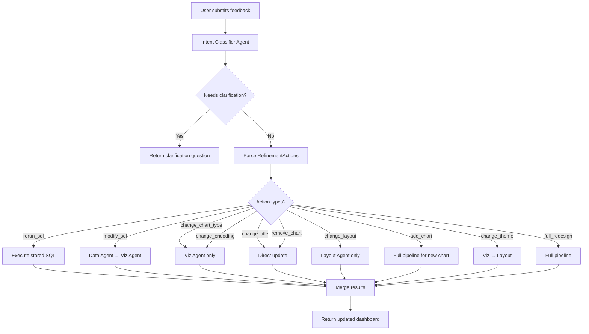

# Smart Dashboard Refinement System

## Overview

Redesign the dashboard refinement system to intelligently classify user intent and execute only the necessary pipeline stages, improving response time and accuracy.

### Current Problem

The existing `/refine` endpoint has two modes:
1. **Full refinement** (`new_feedback`) → Always runs entire 4-stage pipeline
2. **Filter refresh** (`filter_state`) → Only applies SQL filters

This is inefficient because simple requests like "change chart type" trigger full regeneration.

### Solution

Add an **Intent Classification Agent** that analyzes user feedback and determines minimal changes needed.

---

## Supported Refinement Actions

| Action Type | Description | Stages Required | LLM Needed |
|-------------|-------------|-----------------|------------|
| `rerun_sql` | Re-execute existing SQL (refresh data) | None (direct) | No |
| `modify_sql` | Fix/change SQL query (LLM regenerates) | Data → Viz | Yes |
| `change_chart_type` | Switch visualization type | Viz only | Yes |
| `change_encoding` | Change x/y fields, colors, grouping | Viz only | Yes |
| `change_title` | Update chart or dashboard title | None (direct) | No |
| `change_layout` | Rearrange/resize charts | Layout only | Yes |
| `add_chart` | Add new chart to dashboard | Strategy → Data → Viz → Layout | Yes |
| `remove_chart` | Remove existing chart | None (direct) | No |
| `change_theme` | Change color scheme/styling | Viz → Layout | Yes |
| `full_redesign` | Complete dashboard overhaul | Full pipeline | Yes |

### Example Intent Classifications

| User Feedback | Classified Actions |
|---------------|-------------------|
| "Change chart_1 to a line chart" | `[change_chart_type(chart_1, line)]` |
| "The sales data looks wrong, fix it" | `[modify_sql(chart_id=inferred)]` |
| "Refresh all the data" | `[rerun_sql(all)]` |
| "Make chart_2 group by region instead" | `[change_encoding(chart_2, group=region)]` |
| "Move KPIs to the top row" | `[change_layout(...)]` |
| "Add a chart for top 10 products" | `[add_chart("top 10 products")]` |
| "Remove chart 3" | `[remove_chart(chart_3)]` |
| "Change title to Q4 Report" | `[change_title("Q4 Report")]` |
| "Change chart 1 to bar and fix chart 2 data" | `[change_chart_type(chart_1, bar), modify_sql(chart_2)]` |

---

## API Changes

### Current Endpoints

```
POST /api/dashboard/generate    → Full generation
POST /api/dashboard/refine      → Refinement (mixed)
POST /api/dashboard/refresh     → Data refresh
PATCH /api/dashboard/sessions/{id}/layout → Layout update
```

### Proposed Endpoints

```
POST /api/dashboard/generate    → Full generation (unchanged)
POST /api/dashboard/refine      → Smart intent-based refinement (NEW)
POST /api/dashboard/filter      → Fast filter application (NEW, moved from refine)
POST /api/dashboard/refresh     → Data refresh (unchanged)
PATCH /api/dashboard/sessions/{id}/layout → Layout update (unchanged)
```

---

## Proposed Changes

### [NEW] [refinement_classifier.py](file:///Users/hari/Desktop/ai-dashboard/backend/langchain_agents/dashboard/agents/refinement_classifier.py)

New agent that classifies user refinement intent.

```python
class RefinementAction(BaseModel):
    action_type: Literal[
        "rerun_sql", "modify_sql", "change_chart_type", 
        "change_encoding", "change_title", "change_layout",
        "add_chart", "remove_chart", "change_theme", "full_redesign"
    ]
    target_chart_id: Optional[str] = None  # None = all/dashboard-level
    parameters: Dict[str, Any] = {}  # Action-specific params
    confidence: float = 1.0

class RefinementIntent(BaseModel):
    actions: List[RefinementAction]
    requires_clarification: bool = False
    clarification_question: Optional[str] = None
    reasoning: str
```

**Classifier Prompt Structure:**
- Input: user feedback, current dashboard state (titles, chart types, goals)
- Output: structured `RefinementIntent`
- Fallback: If uncertain, set `requires_clarification=True`

---

### [MODIFY] [models.py](file:///Users/hari/Desktop/ai-dashboard/backend/langchain_agents/dashboard/models.py)

Add new request/response models:

```python
class DashboardFilterRequest(BaseModel):
    """Request for fast filter-only updates (moved from refine)."""
    session_id: str
    filter_state: Dict[str, Any]

class DashboardRefineRequest(BaseModel):
    """Updated request for smart refinement."""
    session_id: str
    feedback: str  # Required user feedback
    target_chart_id: Optional[str] = None  # Optional hint

class RefinementIntentResponse(BaseModel):
    """Response when clarification is needed."""
    requires_clarification: bool
    clarification_question: str
    suggested_actions: List[str]
```

---

### [MODIFY] [dashboard.py](file:///Users/hari/Desktop/ai-dashboard/backend/routes/dashboard.py)

#### New `/filter` Endpoint

Move the filter-based logic from current `/refine`:

```python
@router.post("/filter", response_model=DashboardResponse)
async def filter_dashboard(
    request: DashboardFilterRequest,
    current_user: User = Depends(get_current_active_user),
):
    """Apply filters to dashboard charts without LLM."""
    # Existing filter_state logic moved here
```

#### Updated `/refine` Endpoint

```python
@router.post("/refine", response_model=DashboardResponse)
async def refine_dashboard(
    request: DashboardRefineRequest,
    current_user: User = Depends(get_current_active_user),
):
    """Smart intent-based refinement."""
    # 1. Classify intent using new classifier agent
    # 2. If requires_clarification → return question
    # 3. Execute minimal pipeline based on actions
    # 4. Return updated dashboard
```

---

### [MODIFY] [graph.py](file:///Users/hari/Desktop/ai-dashboard/backend/langchain_agents/dashboard/graph.py)

Add selective execution function:

```python
async def run_selective_refinement(
    session_id: str,
    username: str,
    connection_name: str,
    actions: List[RefinementAction],
    current_dashboard: Dict[str, Any],
    chart_goals: List[Dict[str, Any]],
    sql_queries: List[Dict[str, str]],
) -> Dict[str, Any]:
    """
    Execute only the required agents based on classified actions.
    
    Routing logic:
    - rerun_sql → Direct SQL execution (no LLM)
    - modify_sql → Data Agent only
    - change_chart_type/encoding → Viz Agent only
    - change_layout → Layout Agent only
    - add_chart → Strategy → Data → Viz → Layout
    - change_title/remove_chart → Direct update
    - full_redesign → Full pipeline
    """
```

---

### [MODIFY] [state.py](file:///Users/hari/Desktop/ai-dashboard/backend/langchain_agents/dashboard/state.py)

Update `RefinementState` to include classified actions:

```python
class RefinementState(TypedDict):
    # ... existing fields ...
    
    # NEW: Classified refinement actions
    refinement_actions: List[Dict[str, Any]]
    
    # NEW: Track which stages to execute
    execute_strategy: bool
    execute_data: bool
    execute_viz: bool
    execute_layout: bool
```

---

## Execution Flow



---

## Verification Plan

### Automated Tests

1. **Intent Classification Tests**
   - Test each action type is correctly classified
   - Test multi-action classification
   - Test ambiguous input triggers clarification

2. **Selective Execution Tests**
   - Verify only required agents are called
   - Verify unchanged parts are preserved

### Manual Verification

1. Test refinement scenarios:
   - "Change chart 1 to line" → Only Viz runs
   - "Fix the data in chart 2" → Data + Viz runs
   - "Add a pie chart for categories" → Full pipeline
   - "I want something different" → Clarification requested

2. Test the new `/filter` endpoint with various filter states

---

## Implementation Order

1. Create `RefinementAction` and `RefinementIntent` models  
2. Create Intent Classifier Agent with prompt  
3. Create new `/filter` endpoint (move existing logic)  
4. Update `/refine` endpoint with classifier integration  
5. Implement `run_selective_refinement` in graph.py  
6. Add direct update handlers (title, remove chart)  
7. Testing and verification
