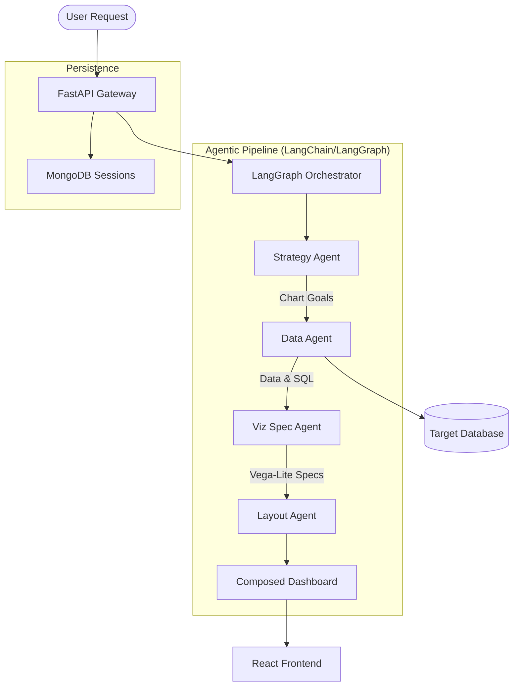

# Architecture

The AI Dashboard follows a distributed, modular architecture where the "brain" is a multi-agent pipeline orchestrated by **LangGraph**.

## System Overview

## The 4-Stage Agent Pipeline

1.  **Strategy Agent (Planner)**: Analyzes the database schema and user prompt to define 3-5 visual objectives.
2.  **Data Agent (Executor)**: Translates objectives into SQL, executes them securely, and retrieves the raw data.
3.  **Viz Spec Agent (Translator)**: Maps the raw data to Vega-Lite visual encoding channels.
4.  **Layout Agent (Composer)**: Determines the optimal arrangement (grid, horizontal, vertical) for the charts.

## Core Principles
1.  **Immutability**: Agents communicate via a shared state object.
2.  **Validation**: Every stage output is validated by Pydantic models.
3.  **Asynchronicity**: Long-running generation tasks are handled via SSE streaming.
